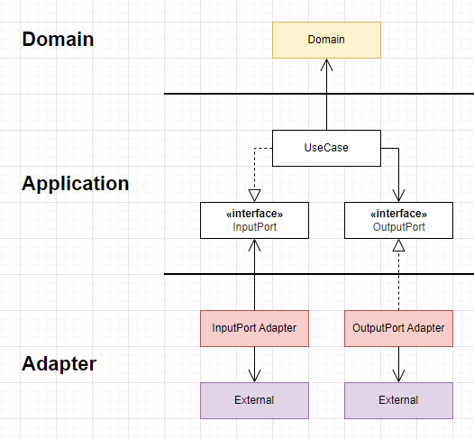

# Module - Feature
- 負責提供使用者互動情境 (垂直切片)
- 會涉及到 UI
- 可以使用 Core 提供的操作，也可以引入額外所需的外部服務(仍需做 DIP )

基本形如下圖

## Extra

### 都要 DIP ?
並非所有外部功能都要做 DIP，以 ClassicGame 來說，配對遊戲的核心邏輯(MemoryMatching) 這將會被直接 Import 到 Domain 裡並作為基礎來開發。

DIP 的目的是希望通過依賴於穩定的對象，來避免實作變化擴散，但如果沒有更換的必要，那直接引用沒有問題。

### 違反 DIP ?
對 Clean Architecture 來說 Application 中使用的介面不是自己定義的是否為有效 DIP ?

不是，但有些情況能接受。
退一步的做法是依賴"組織"所開出來的介面，組織的規範如果是嚴格且一致的，可以說是相對穩定，基本上是比較泛用的功能才這樣使用(聲音/廣告/logger...)

---

**以下是專案的 Features**
  | Name | Description |      
  | --- | --- |
  Lobby | 應用程式入口       
  ClassicGameRoom | 遊戲 - 經典模式 |
  BattleGameRoom | 遊戲 - 對戰模式 |  
  CollectionAlbum | 收集冊 |
  EncourageMe | 商店連結 / 廣告 |
  Credit | 一些 licenses 連結 |
